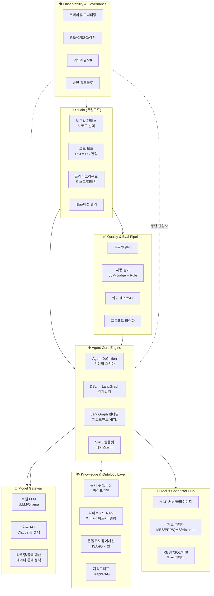
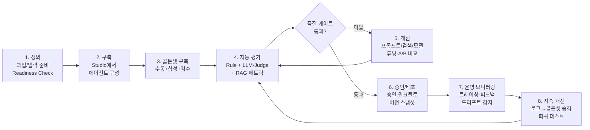

# AgentBuilder 기능정의서 (Functional Specification)

**제조 도메인 특화 Enterprise AgentBuilder 플랫폼/Studio**

| 항목 | 내용 |
|---|---|
| 문서 버전 | v0.1 (Draft) |
| 작성일 | 2026-07-17 |
| 상태 | 검토 대기 |
| 다음 단계 | 기능정의 확정 → 설계문서(02) 작성 |

---

## 목차

1. [개요](#1-개요)
2. [플랫폼 비전 및 설계 원칙](#2-플랫폼-비전-및-설계-원칙)
3. [사용자 정의 (페르소나)](#3-사용자-정의-페르소나)
4. [시스템 모듈 구성 개요](#4-시스템-모듈-구성-개요)
5. [기능 요구사항 (FR)](#5-기능-요구사항-fr)
   - 5.1 [FR-AGT: 에이전트 정의 및 오케스트레이션](#51-fr-agt-에이전트-정의-및-오케스트레이션-코어-엔진)
   - 5.2 [FR-STD: Studio](#52-fr-std-studio)
   - 5.3 [FR-KNW: 지식 및 온톨로지](#53-fr-knw-지식-및-온톨로지)
   - 5.4 [FR-MDL: 모델 게이트웨이](#54-fr-mdl-모델-게이트웨이)
   - 5.5 [FR-TOL: 도구 및 커넥터](#55-fr-tol-도구-및-커넥터)
   - 5.6 [FR-EVL: 품질/평가 파이프라인](#56-fr-evl-품질평가-파이프라인)
   - 5.7 [FR-OPS: 운영 및 관측성](#57-fr-ops-운영-및-관측성)
   - 5.8 [FR-GOV: 거버넌스 및 보안](#58-fr-gov-거버넌스-및-보안)
   - 5.9 [FR-DEP: 배포 및 실행환경](#59-fr-dep-배포-및-실행환경)
6. [입력(Input) 자산 정의](#6-입력input-자산-정의)
7. [품질/성능 향상 파이프라인](#7-품질성능-향상-파이프라인)
8. [제조 도메인 유스케이스](#8-제조-도메인-유스케이스)
9. [비기능 요구사항 (NFR)](#9-비기능-요구사항-nfr)
10. [오픈소스 스택 권고안](#10-오픈소스-스택-권고안)
11. [단계별 로드맵](#11-단계별-로드맵)
12. [리스크 및 열린 질문](#12-리스크-및-열린-질문)

---

## 1. 개요

### 1.1 목적

제조 기업의 현업 전문가와 AI 엔지니어가 **협업하여 AI 에이전트를 개발·구성·검증·운영**할 수 있는
온프레미스 중심의 AgentBuilder 플랫폼을 구축한다. 데이터 주권과 보안이 중요한 제조
Enterprise 환경에서, 오픈소스를 기반으로 로컬에서 완결적으로 동작하면서도 필요 시 외부
상용 LLM API를 선택적으로 활용할 수 있는 하이브리드 구조를 갖는다.

### 1.2 배경 및 문제 정의

| 현재 문제 | 플랫폼의 해결 방향 |
|---|---|
| 에이전트 개발이 AI 엔지니어에게만 가능 → 현업 지식이 반영되기 어려움 | 듀얼모드 Studio(노코드 + 코드)로 현업/엔지니어 협업 구조 제공 |
| PoC성 에이전트는 만들어지나 품질 검증·운영 체계 부재 → 프로덕션 전환 실패 | 평가 파이프라인(Eval-driven) + 관측성 + 승인 워크플로 내장 |
| 사내 문서·데이터가 산재하고 용어가 비표준 → RAG 품질 저하 | 온톨로지/용어사전/지식그래프 기반 지식 구조화 레이어 제공 |
| 프레임워크(LangGraph 등) 직접 사용 시 재사용성·표준화 부족 | 선언적 Agent 정의 스키마(DSL)로 표준화, 템플릿/컴포넌트 재사용 |
| 보안·감사·권한 요건으로 SaaS형 도구 도입 불가 | 온프레미스 완결 동작, RBAC/감사로그/데이터 거버넌스 내장 |

### 1.3 범위

**포함 (In Scope)**

- 에이전트 정의/오케스트레이션 코어 엔진 (LangGraph 기반 + 추상화 레이어)
- Studio (비주얼 빌더, 코드 모드, 테스트 플레이그라운드, 배포 관리)
- 지식 레이어 (문서 수집/파싱, RAG, 온톨로지, 지식그래프)
- 모델 게이트웨이 (로컬 LLM 서빙 연동 + 외부 API 라우팅)
- 도구/커넥터 허브 (MES·ERP·QMS 등 제조 시스템 연계, MCP 지원)
- 품질/평가 파이프라인 (골든셋, 자동평가, 회귀테스트, 프롬프트 최적화)
- 운영/거버넌스 (관측성, RBAC, 감사, 승인 워크플로, 가드레일)

**제외 (Out of Scope) — 본 버전 기준**

- LLM 자체 사전학습(pre-training) — 파인튜닝 연계는 Phase 3 선택 항목
- MES/ERP 등 기간계 시스템 자체의 기능 대체
- 로봇/설비 실시간 제어(closed-loop control) — 에이전트는 조회·분석·제안·승인 기반 실행까지만
- 멀티테넌트 SaaS 서비스형 제공 (단일 기업 내 멀티 조직/사업장은 지원)

### 1.4 용어 정의

| 용어 | 정의 |
|---|---|
| Agent | 목표를 부여받아 LLM 추론 + 도구 호출 + 지식 검색을 반복하며 과업을 수행하는 실행 단위 |
| Workflow | 복수 Agent/노드를 그래프로 연결한 실행 흐름 (LangGraph StateGraph에 대응) |
| Agent Definition (DSL) | Agent/Workflow를 선언적으로 기술하는 플랫폼 표준 스키마 (YAML/JSON) |
| Skill | Agent에 부착 가능한 재사용 능력 단위 (도구 묶음 + 지시문 + 지식 소스) |
| Knowledge Space | 접근 권한 경계를 갖는 지식(문서·벡터·그래프) 논리 컨테이너 |
| 온톨로지 | 설비·자재·공정·불량 등 제조 개체와 관계를 표준화한 개념 체계 (ISA-95 기반) |
| 골든셋 | 에이전트 품질 평가 기준이 되는 검증된 입력-기대출력 데이터셋 |
| HITL | Human-in-the-Loop. 실행 중 사람의 검토·승인을 요구하는 절차 |
| Model Gateway | 로컬/외부 LLM을 단일 인터페이스로 추상화하고 라우팅·통제하는 모듈 |
| MCP | Model Context Protocol. 도구/데이터 소스 연동 개방형 표준 |

### 1.5 우선순위 표기

| 표기 | 의미 |
|---|---|
| **P0** | 필수. MVP에 반드시 포함 |
| **P1** | 중요. 정식 버전(1.0)까지 포함 |
| **P2** | 권장. 로드맵 후속 단계에서 포함 |

---

## 2. 플랫폼 비전 및 설계 원칙

> **"제조 현장의 지식을 구조화하고, 누구나 신뢰할 수 있는 에이전트를 만들 수 있게 한다."**

### 설계 원칙

1. **Local-First, Hybrid-Ready** — 모든 기능은 폐쇄망에서 완결 동작한다. 외부 LLM API는
   관리자가 명시적으로 허용한 경우에만, 데이터 통제 정책 하에 선택적으로 사용한다.
2. **선언적 정의가 단일 소스 (Declarative Single Source of Truth)** — 비주얼 캔버스와 코드
   모드는 동일한 Agent Definition(YAML/JSON)을 편집하는 두 가지 뷰다. Git으로 버전 관리
   가능해야 한다.
3. **모듈식 코어, 교체 가능한 구현** — 오케스트레이션 엔진(LangGraph), 벡터DB, LLM 서빙 등
   핵심 의존성은 어댑터 인터페이스 뒤에 두어 교체 가능하게 한다.
4. **평가 없이 배포 없다 (Eval-Driven)** — 모든 에이전트는 골든셋 기반 평가를 통과해야
   프로덕션 배포가 가능하다. 품질은 감이 아니라 측정으로 관리한다.
5. **지식은 구조화되어야 한다** — 단순 문서 덤프형 RAG를 넘어, 온톨로지·용어사전·지식그래프로
   제조 도메인 지식을 구조화하여 검색·추론 품질을 높인다.
6. **Enterprise 신뢰성 내장** — RBAC, 감사로그, 승인 워크플로, 가드레일, HITL은 부가 기능이
   아니라 코어 요건이다.
7. **오픈소스 우선, 표준 우선** — 검증된 오픈소스(LangGraph, vLLM, Qdrant 등)와 개방형 표준
   (MCP, OpenTelemetry, OPC-UA, ISA-95)을 우선 채택한다.

---

## 3. 사용자 정의 (페르소나)

| 페르소나 | 역할 | 주 사용 기능 | 요구 수준 |
|---|---|---|---|
| **도메인 전문가 / 현업 사용자** (품질·설비·공정 엔지니어) | 에이전트 요구 정의, 노코드 구성, 지식 검수, 평가 피드백 | Studio 비주얼 캔버스, 템플릿, 플레이그라운드, 지식 검수 UI | 코딩 불필요 |
| **AI 엔지니어 / 개발자** | 커스텀 노드·도구 개발, 복잡한 워크플로 구현, 성능 튜닝 | 코드 모드, SDK, DSL 직접 편집, 평가 파이프라인 구성 | Python 숙련 |
| **지식 관리자 (Knowledge Curator)** | 문서 수집 관리, 온톨로지/용어사전 관리, 지식 품질 관리 | 지식 레이어 관리 콘솔, 온톨로지 편집기 | 도메인 지식 + 기본 IT |
| **플랫폼 관리자** | 사용자/권한 관리, 모델·커넥터 등록, 정책 설정, 인프라 운영 | 관리 콘솔, Model Gateway 설정, 감사로그 | IT 인프라 숙련 |
| **검토자 / 승인자** (팀장, 품질보증, 보안담당) | 에이전트 배포 승인, HITL 승인 처리, 감사 검토 | 승인 워크플로 UI, 평가 리포트, 감사 대시보드 | 코딩 불필요 |
| **최종 사용자** (현장 작업자, 오퍼레이터) | 배포된 에이전트 사용 (챗, 임베디드 위젯, API) | 에이전트 소비 채널 | 없음 |

---

## 4. 시스템 모듈 구성 개요

### 모듈 요약

| 모듈 | 책임 | 핵심 오픈소스 후보 |
|---|---|---|
| Agent Core Engine | Agent 정의 스키마, LangGraph 컴파일/실행, 상태 관리, HITL | LangGraph, LangChain |
| Studio | 비주얼 빌더, 코드 모드, 플레이그라운드, 배포 관리 | React, React Flow, Monaco Editor |
| Knowledge & Ontology | 문서 파이프라인, RAG, 온톨로지, 지식그래프 | Docling, Qdrant, Neo4j/LightRAG, BGE-M3 |
| Model Gateway | LLM 추상화, 라우팅, 예산/정책 통제 | LiteLLM, vLLM, Ollama |
| Tool & Connector Hub | 도구 레지스트리, MCP, 제조 시스템 커넥터 | MCP SDK, opcua-asyncio, SQLAlchemy |
| Quality & Eval | 골든셋, 자동 평가, 회귀 테스트, 최적화 | Ragas, DeepEval, promptfoo, DSPy |
| Observability & Governance | 트레이싱, RBAC, 감사, 가드레일 | Langfuse, Keycloak, OpenTelemetry, NeMo Guardrails |
| Deployment & Runtime | API 서빙, 스케줄러, 채널 연동 | FastAPI, PostgreSQL, Redis, K8s/Compose |

---

## 5. 기능 요구사항 (FR)

### 5.1 FR-AGT: 에이전트 정의 및 오케스트레이션 (코어 엔진)

#### FR-AGT-01 선언적 Agent Definition 스키마 (P0)

- Agent/Workflow를 YAML/JSON으로 기술하는 플랫폼 표준 스키마를 제공한다.
- 스키마 구성 요소: 메타데이터(이름/버전/소유자/도메인 태그), 모델 설정(모델 별칭, 파라미터),
  시스템 지시문(프롬프트 템플릿 참조), 도구 바인딩, 지식 소스 바인딩(Knowledge Space 참조),
  입출력 스키마(구조화 출력 정의), 그래프 토폴로지(노드/엣지/조건 분기), 실행 정책
  (타임아웃, 재시도, 최대 스텝, HITL 지점), 가드레일 정책 참조.
- JSON Schema 기반 유효성 검증 및 버전 마이그레이션을 지원한다.
- **모든 정의는 Git 저장소와 양방향 동기화 가능해야 한다** (GitOps 지원).

#### FR-AGT-02 DSL → LangGraph 컴파일러 (P0)

- Agent Definition을 LangGraph `StateGraph`로 변환하는 컴파일러를 제공한다.
- 컴파일 시점 검증: 노드 참조 무결성, 도구 권한 정합성, 순환 참조 검사, 미도달 노드 경고.
- 엔진 추상화: 컴파일러 백엔드는 인터페이스로 분리하여 향후 다른 엔진으로 교체 가능하게 한다.
- 코드 모드에서 작성한 커스텀 Python 노드를 그래프에 등록해 혼합 사용할 수 있다.

#### FR-AGT-03 오케스트레이션 패턴 지원 (P0)

다음 패턴을 내장 노드/템플릿으로 제공한다.

| 패턴 | 설명 | 우선순위 |
|---|---|---|
| Single Agent + Tools | 단일 에이전트 ReAct 루프 | P0 |
| Sequential Workflow | 노드 순차 실행 파이프라인 | P0 |
| Conditional Branch | 조건/LLM 판단 기반 분기 | P0 |
| Parallel Fan-out/Fan-in | 병렬 실행 후 결과 병합 | P1 |
| Supervisor (멀티에이전트) | 감독 에이전트가 하위 에이전트에 작업 위임 | P1 |
| Reflection / Self-Critique | 생성 → 자체 검증 → 수정 루프 | P1 |
| Plan-and-Execute | 계획 수립 후 단계별 실행 | P2 |
| Handoff/Swarm | 에이전트 간 제어권 이양 | P2 |

#### FR-AGT-04 상태 관리 및 내구성 실행 (P0)

- LangGraph 체크포인터 기반 실행 상태 영속화 (PostgreSQL 백엔드).
- 중단 지점부터 재개(resume), 특정 스텝으로 되감기(time-travel) 지원.
- 장시간 실행 워크플로(수 시간~일 단위)의 내구성 보장.
- 세션/스레드 단위 대화 메모리 + 장기 메모리(사용자·조직 스코프) 지원 (장기 메모리는 P1).

#### FR-AGT-05 Human-in-the-Loop (P0)

- 그래프의 임의 지점에 **승인 게이트**(interrupt)를 선언적으로 배치할 수 있다.
- 승인 유형: 단순 승인/반려, 수정 후 승인(사람이 파라미터 편집), 선택지 응답.
- 승인 대기 중 상태는 영속화되며, 승인자에게 알림(웹훅/메일/메신저)이 발송된다.
- 도구 실행 정책: 도구별로 `자동 실행 / 승인 필요 / 금지` 3단계 정책을 설정할 수 있다
  (예: 조회성 SQL은 자동, MES 작업지시 변경은 승인 필요).

#### FR-AGT-06 Skill / 템플릿 레지스트리 (P1)

- Skill: 도구 묶음 + 지시문 + 지식 소스 참조를 하나의 재사용 단위로 패키징.
- 조직 공유 레지스트리에서 Skill/에이전트 템플릿/워크플로 템플릿을 검색·설치·버전 관리.
- 제조 도메인 기본 템플릿 제공 (8장 유스케이스 기반 스타터 팩).

#### FR-AGT-07 구조화 출력 및 도구 호출 신뢰성 (P0)

- Pydantic/JSON Schema 기반 구조화 출력 강제 및 자동 재시도(출력 파싱 실패 시).
- 도구 호출 인자 유효성 검증, 실패 시 에러 컨텍스트를 포함한 재시도 루프.
- 로컬 LLM의 함수 호출 능력 편차를 보정하는 프롬프트 기반 폴백 모드 제공.

---

### 5.2 FR-STD: Studio

#### FR-STD-01 비주얼 워크플로 캔버스 (P0)

- 드래그앤드롭 노드 편집기 (React Flow 기반): 노드 팔레트(LLM 노드, 도구 노드, 분기,
  병렬, HITL 게이트, 지식 검색, 코드 노드 등), 연결선 유효성 실시간 검증.
- 노드 속성 패널: 프롬프트 편집(변수 하이라이팅), 모델 선택, 도구/지식 바인딩.
- 캔버스 ↔ DSL 실시간 양방향 동기화 (캔버스 편집 → YAML 반영, YAML 편집 → 캔버스 반영).
- 실행 시각화: 실행 중/완료/실패 노드 상태 색상 표시, 노드별 입출력 데이터 인스펙션.

#### FR-STD-02 코드 모드 (P0)

- Monaco 기반 에디터: DSL(YAML) 직접 편집 + 커스텀 Python 노드/도구 작성.
- 스키마 자동완성, 실시간 유효성 검증, DSL diff 뷰.
- Python SDK: 코드로 정의한 에이전트를 플랫폼에 등록/배포하는 개발자 워크플로 지원
  (로컬 IDE 개발 → CLI로 push).

#### FR-STD-03 플레이그라운드 (테스트/디버깅) (P0)

- 채팅형 인터랙티브 테스트: 배포 전 에이전트와 대화하며 동작 확인.
- 스텝 디버거: 노드 단위 실행 추적, 각 스텝의 프롬프트/응답/도구 호출 원문 확인.
- 검색 디버거: RAG 질의에 대해 어떤 청크가 어떤 점수로 검색되었는지 확인.
- 시나리오 저장: 테스트 대화를 골든셋 후보로 저장 (FR-EVL 연계).
- 비교 실행: 동일 입력에 대해 모델/프롬프트 변형 A/B 나란히 비교 (P1).

#### FR-STD-04 프롬프트 자산 관리 (P0)

- 프롬프트 템플릿 저장소: 변수 치환, 버전 이력, diff, 롤백.
- 프롬프트-에이전트 참조 관계 추적 (이 프롬프트를 쓰는 에이전트 목록).
- 도메인 용어사전 연동: 프롬프트 내 표준 용어 자동 제안 (P2).

#### FR-STD-05 배포 및 버전 관리 (P0)

- 에이전트 버전 스냅샷: 정의+프롬프트+지식 바인딩+모델 설정을 묶어 불변 버전 생성.
- 환경 분리: `개발 → 스테이징 → 프로덕션` 승격(promotion) 파이프라인.
- 배포 채널: REST API 엔드포인트 자동 생성(P0), 웹 챗 UI(P0), 임베더블 위젯(P1),
  메신저 연동 – Teams/Slack/카카오워크 등(P2), 스케줄 실행 – 크론 트리거(P1),
  이벤트 트리거 – 웹훅/Kafka 메시지 기반(P1).
- 롤백: 프로덕션 버전 즉시 이전 버전으로 전환.
- 카나리 배포: 트래픽 비율 기반 신버전 점진 적용 (P2).

#### FR-STD-06 협업 기능 (P1)

- 프로젝트/워크스페이스 단위 구성원 관리, 에이전트 소유권/편집 권한.
- 변경 이력 (누가 언제 무엇을), 코멘트/리뷰 요청.
- 동시 편집 잠금 또는 실시간 협업 편집 (잠금 방식이 P1, 실시간 편집은 P2).

#### FR-STD-07 대시보드 및 카탈로그 (P1)

- 조직 에이전트 카탈로그: 도메인 태그/상태/사용량 기준 검색·탐색.
- 에이전트별 요약 대시보드: 호출량, 성공률, 평가 점수 추이, 비용(토큰).

---

### 5.3 FR-KNW: 지식 및 온톨로지

#### FR-KNW-01 문서 수집 및 파싱 파이프라인 (P0)

- 지원 포맷: PDF(스캔본 OCR 포함), Office(docx/xlsx/pptx), HWP/HWPX(한국 제조현장 필수),
  이미지(도면 캡처 등), HTML, Markdown, 텍스트.
- 파싱 품질: 표 구조 보존, 다단 레이아웃 처리, 머리글/꼬리글 제거, 도면·이미지 캡션 추출.
  (Docling 기반 + HWP 전용 파서 별도 개발 필요)
- 수집 방식: 수동 업로드, 폴더/파일서버(SMB/NFS) 주기 동기화(P1), SharePoint/Confluence
  커넥터(P2).
- 수집 파이프라인 구성: 파싱 → 클리닝 → 청킹(전략 선택 가능: 고정/구조 기반/시맨틱) →
  메타데이터 부착 → 임베딩 → 색인. 각 단계 설정을 Knowledge Space 별로 커스터마이즈.
- 증분 업데이트: 문서 변경 감지 시 해당 청크만 재색인. 문서 버전 이력 관리.

#### FR-KNW-02 Knowledge Space (지식 공간) (P0)

- 접근 권한 경계를 갖는 지식 논리 컨테이너 (예: "품질-8D리포트", "설비-정비매뉴얼").
- 에이전트는 허용된 Knowledge Space만 바인딩 가능 (RBAC 연동).
- Space 별 색인 설정(청킹/임베딩 모델/검색 전략) 독립 구성.
- 문서 단위 접근 등급(공개/부서/비밀) 메타데이터 및 검색 시 권한 필터링 (P1).

#### FR-KNW-03 하이브리드 검색 및 RAG (P0)

- 벡터 검색 + 키워드(BM25) 하이브리드 검색, 결과 융합(RRF).
- 리랭커(cross-encoder) 적용 옵션 (P0), 쿼리 확장/재작성(P1), HyDE(P2).
- 메타데이터 필터 검색 (설비ID, 라인, 제품코드, 기간 등 제조 컨텍스트 필터).
- **근거 인용 강제**: RAG 응답에 출처 문서/페이지/청크 인용을 구조적으로 포함. 인용 없는
  주장 차단 옵션.
- 한국어 최적화: 한국어 특화 임베딩(BGE-M3 등), 형태소 분석 기반 키워드 색인.

#### FR-KNW-04 제조 온톨로지 관리 (P1)

- **표준 기반 스켈레톤 제공**: ISA-95(IEC 62264) 설비 계층
  (Enterprise → Site → Area → Line → Work Cell → Equipment)을 기본 골격으로 제공하고,
  기업별 확장을 지원한다.
- 관리 대상 개념 체계: 설비 마스터(설비 BOM 포함), 자재/품목 분류, 공정 분류, 불량 코드
  체계, 측정 항목, 조직/역할.
- 임포트: CSV/Excel(마스터데이터), OWL/RDF/SKOS(기존 온톨로지), ERP·MES 마스터 테이블
  동기화(P2).
- 온톨로지 편집기: 웹 기반 클래스/인스턴스/관계 편집, 버전 관리, 변경 검토 워크플로.

#### FR-KNW-05 용어사전 및 동의어 관리 (P1)

- 표준 용어 ↔ 현장 용어/약어/외래어 매핑 관리 (예: "다이캐스팅기 3호" = "DC3" = "3번 주조기").
- 검색 시 동의어 확장 자동 적용, 프롬프트 컨텍스트에 관련 용어 정의 주입 옵션.
- 현업 검수 워크플로: 문서에서 후보 용어 자동 추출(P2) → 지식 관리자 승인 → 사전 등재.

#### FR-KNW-06 지식그래프 및 GraphRAG (P2)

- 온톨로지 스키마를 준수하는 지식그래프 구축: 문서에서 엔티티/관계 추출(LLM 기반) →
  온톨로지 엔티티 링킹 → 그래프 저장.
- GraphRAG 검색: 벡터 검색 결과의 엔티티를 그래프에서 확장 탐색하여 관계 기반 컨텍스트
  보강 (예: 불량코드 → 관련 설비 → 과거 정비 이력 연결).
- 그래프 시각화 뷰어: 엔티티 중심 탐색 UI.
- 정형 데이터 시맨틱 레이어: 온톨로지 개념 ↔ DB 테이블/컬럼 매핑을 관리하여 Text-to-SQL
  정확도 향상 (P2, FR-TOL-04 연계).

#### FR-KNW-07 지식 품질 관리 (P1)

- 색인 상태 대시보드: 문서 수, 파싱 실패, 미검수 문서, 오래된 문서(유효기간) 현황.
- 지식 커버리지 분석: 사용자 질문 로그 중 검색 실패/저신뢰 답변 클러스터링 → 문서 보강
  우선순위 제안 (P2).
- 문서 검수 워크플로: 신규 문서 색인 전 지식 관리자 승인 옵션.

---

### 5.4 FR-MDL: 모델 게이트웨이

#### FR-MDL-01 통합 모델 인터페이스 (P0)

- 모든 LLM 호출은 Model Gateway를 경유한다 (OpenAI 호환 API 표준화, LiteLLM 기반).
- 지원 백엔드: vLLM(프로덕션 GPU 서빙), Ollama(개발/소규모), 외부 API(Anthropic Claude,
  OpenAI 등 — 관리자 허용 시), 사내 기존 LLM 서빙 엔드포인트.
- **모델 별칭(alias) 체계**: 에이전트는 `chat-large`, `chat-fast`, `embedding-ko` 같은
  별칭만 참조하고, 실제 모델 매핑은 관리자가 중앙에서 변경한다 (모델 교체 시 에이전트
  수정 불필요).

#### FR-MDL-02 하이브리드 라우팅 및 데이터 통제 정책 (P0)

- **데이터 등급 기반 라우팅**: Knowledge Space/에이전트에 데이터 민감 등급을 지정하고,
  등급별 허용 모델 대상을 정책으로 강제 (예: `기밀` 등급은 로컬 모델만 허용).
- 외부 API 사용 시 통제: 프로젝트별 허용 목록, PII 마스킹 후 전송 옵션(P1), 전송 내용
  감사 로깅.
- 폴백 체인: 1차 모델 장애/타임아웃 시 대체 모델 자동 전환.
- 비용/예산 관리: 프로젝트·에이전트별 토큰 예산 설정, 초과 시 차단/알림.

#### FR-MDL-03 임베딩/리랭커 모델 서빙 (P0)

- 임베딩 모델과 리랭커 모델도 게이트웨이 별칭 체계로 통합 관리.
- 임베딩 모델 변경 시 영향받는 Knowledge Space 재색인 필요성 자동 감지·안내.

#### FR-MDL-04 모델 카탈로그 및 벤치마크 (P1)

- 등록 모델 카탈로그: 컨텍스트 길이, 함수 호출 지원 여부, 라이선스, GPU 요구사항.
- 사내 벤치마크: 골든셋 기반으로 신규 모델을 기존 모델과 비교 평가하는 원클릭 벤치마크
  (FR-EVL 연계) — 모델 업그레이드 의사결정 지원.

#### FR-MDL-05 파인튜닝 연계 (P2)

- 운영 로그에서 학습 데이터셋 후보 추출(승인된 우수 응답), 파인튜닝 잡 실행 연계
  (LoRA 기반), 튜닝 모델의 카탈로그 등록 및 평가 파이프라인 통과 후 배포.

---

### 5.5 FR-TOL: 도구 및 커넥터

#### FR-TOL-01 도구 레지스트리 (P0)

- 도구 정의: 이름, 설명(LLM이 읽는 사용 설명), 입출력 JSON Schema, 실행 정책
  (자동/승인/금지 — FR-AGT-05 연계), 소유자, 버전.
- 도구 유형: 내장 도구, 커스텀 Python 도구, REST API 도구(OpenAPI 스펙 임포트),
  SQL 도구, MCP 도구.
- 도구 단위 테스트 실행기: 등록 시 샘플 입력으로 동작 검증.
- 권한: 도구별 사용 허용 프로젝트/역할 지정.

#### FR-TOL-02 MCP 지원 (P0)

- MCP 클라이언트: 사내/외부 MCP 서버를 등록하면 해당 도구들이 레지스트리에 자동 노출.
- MCP 서버: 플랫폼의 지식 검색/온톨로지 조회 기능을 MCP 서버로 노출하여 외부 에이전트
  (Claude Code 등)에서도 활용 가능 (P1).

#### FR-TOL-03 제조 시스템 커넥터 (P1)

| 커넥터 | 대상 | 우선순위 |
|---|---|---|
| RDB 커넥터 | MES/ERP/QMS의 DB 뷰 (Oracle, MSSQL, PostgreSQL, MySQL) | P0 |
| REST/OpenAPI 커넥터 | 기간계 시스템 API | P0 |
| 파일 커넥터 | SMB/NFS/SFTP 파일서버, CSV/Excel 배치 | P1 |
| Historian/시계열 | OPC-UA 조회, InfluxDB/TimescaleDB, PI 연동 | P1 |
| 메시지 버스 | Kafka/MQTT 구독 (이벤트 트리거용) | P1 |
| ERP 전용 | SAP RFC/OData 등 | P2 |

- 커넥터는 **읽기 전용을 기본**으로 하고, 쓰기 작업은 도구 실행 정책 `승인 필요` 이상을
  강제한다.
- 연결 정보(자격증명)는 시크릿 저장소에 암호화 보관, 도구 정의와 분리.

#### FR-TOL-04 Text-to-SQL / 정형 데이터 질의 (P1)

- 등록된 DB 스키마에 대한 자연어 질의 → SQL 생성 → 실행 → 결과 요약 도구.
- 시맨틱 레이어: 테이블/컬럼 설명, 조인 관계, 대표 질의 예시를 관리하여 정확도 향상.
  온톨로지 매핑(FR-KNW-06)과 연계.
- 안전장치: SELECT 전용 강제, 행 수 제한, 실행 계획 비용 상한, 생성 SQL 사용자 확인 옵션.

#### FR-TOL-05 내장 유틸리티 도구 (P1)

- 계산기/단위 변환, 일시/근무조(shift) 계산, 차트 생성(통계 시각화), 문서 생성
  (보고서 템플릿 채우기 → docx/PDF 출력), 이메일/알림 발송(승인 정책 적용).

---

### 5.6 FR-EVL: 품질/평가 파이프라인

> 원칙: **"평가 없이 배포 없다."** 에이전트 품질·성능 향상은 아래 파이프라인이 담당한다.

#### FR-EVL-01 골든셋(평가 데이터셋) 관리 (P0)

- 데이터셋 구조: 입력(질문/시나리오), 기대 출력 또는 평가 기준(rubric), 근거 문서 참조,
  메타데이터(도메인, 난이도, 유형).
- 구축 경로: 수동 작성 UI, 플레이그라운드 대화에서 승격(FR-STD-03), 운영 로그에서 승격
  (좋은/나쁜 사례), 문서 기반 합성 생성(LLM으로 Q&A 자동 생성 후 현업 검수) (P1).
- 버전 관리 및 에이전트-데이터셋 연결 관리.

#### FR-EVL-02 자동 평가 실행 (P0)

- 평가 방법:
  - **Rule 기반**: 정확 일치, 포함 여부, 정규식, JSON 스키마 준수, 인용 존재 여부.
  - **LLM-as-Judge**: rubric 기반 채점 (정확성, 근거성, 완결성, 형식 준수). Judge 모델과
    프롬프트는 커스터마이즈 가능하며, Judge 자체의 신뢰도 검증(사람 채점과의 일치도)
    기능 포함 (P1).
  - **RAG 특화 메트릭**: faithfulness(환각), answer relevancy, context precision/recall
    (Ragas 계열).
  - **에이전트 궤적 평가**: 올바른 도구를 올바른 인자로 호출했는가, 스텝 효율성 (P1).
- 평가 리포트: 총점/항목별 점수, 실패 케이스 드릴다운(개별 트레이스 연결), 버전 간 비교.

#### FR-EVL-03 회귀 테스트 및 배포 게이트 (P0)

- 에이전트 버전 생성/승격 시 지정된 골든셋 평가를 자동 실행.
- **품질 게이트**: 기준 점수 미달 시 프로덕션 승격 차단 (관리자 오버라이드는 감사 기록).
- 변경 영향 자동 감지: 프롬프트/모델/지식 변경 시 재평가 필요 알림.
- CI 연동: Git 저장소의 정의 변경 시 평가 파이프라인 트리거 (P1).

#### FR-EVL-04 운영 피드백 루프 (P1)

- 최종 사용자 피드백 수집: 👍/👎 + 사유, 정답 제안.
- 피드백 → 개선 워크플로: 부정 피드백 자동 분류(지식 부족/프롬프트 문제/도구 오류) →
  담당자 할당 → 골든셋 반영.
- 온라인 모니터링: 프로덕션 트래픽 샘플링 자동 평가로 품질 드리프트 감지.

#### FR-EVL-05 프롬프트/파이프라인 최적화 (P2)

- A/B 실험: 프롬프트·모델·검색 설정 변형을 골든셋으로 병렬 비교.
- 자동 프롬프트 최적화: DSPy 계열 옵티마이저로 골든셋 기반 프롬프트/퓨샷 자동 탐색.
- RAG 파라미터 튜닝: 청킹 크기, top-k, 리랭커 사용 여부 등의 조합 탐색 리포트.

#### FR-EVL-06 레드팀/안전성 평가 (P1)

- 프롬프트 인젝션, 탈옥, 권한 우회, 민감정보 유출 시나리오 자동 테스트 스위트.
- 제조 도메인 안전 시나리오: 잘못된 작업 지시 유도, 안전 절차 생략 답변 등 도메인 특화
  위험 케이스 평가.

---

### 5.7 FR-OPS: 운영 및 관측성

#### FR-OPS-01 전 구간 트레이싱 (P0)

- 모든 에이전트 실행을 트레이스로 기록: 세션 → 실행 → 노드 → LLM 호출/도구 호출/검색
  계층 구조, 각 스팬의 입출력·토큰·지연시간·비용.
- Langfuse(셀프호스팅) 기반 + OpenTelemetry 표준 계측으로 기존 사내 APM 연동 가능.
- 트레이스 → 플레이그라운드 재현: 문제 트레이스를 한 클릭으로 재실행/디버깅.

#### FR-OPS-02 모니터링 및 알림 (P0)

- 운영 대시보드: 호출량, 성공/실패율, p50/p95 지연, 토큰 사용량, HITL 대기 건수.
- 알림 규칙: 오류율 급증, 지연 임계 초과, 예산 소진, 평가 점수 드리프트 → 웹훅/메일 발송.
- GPU/서빙 인프라 상태 연동 뷰 (vLLM 큐 대기, GPU 사용률) (P1).

#### FR-OPS-03 실행 이력 및 세션 관리 (P0)

- 세션/대화 이력 조회(권한 기반), 보존 기간 정책, 개인정보 자동 마스킹 저장 옵션(P1).

---

### 5.8 FR-GOV: 거버넌스 및 보안

#### FR-GOV-01 인증 및 권한 (P0)

- SSO 연동: OIDC/SAML (Keycloak 내장 또는 사내 IdP 연동), LDAP/AD 동기화 (P1).
- RBAC: 역할(관리자/개발자/현업 편집자/검토자/뷰어/최종사용자) × 리소스
  (프로젝트, 에이전트, Knowledge Space, 도구, 모델) 권한 매트릭스.
- API 키/서비스 계정: 배포된 에이전트 API 소비용 키 발급·회수·만료 관리.

#### FR-GOV-02 감사 로그 (P0)

- 모든 관리 행위(정의 변경, 배포, 권한 변경, 정책 변경)와 실행 행위(도구 실행, 외부 API
  전송, HITL 승인/반려)를 변조 방지 가능한 형태로 기록.
- 감사 조회 UI + 표준 포맷 내보내기(SIEM 연동) (P1).

#### FR-GOV-03 가드레일 (P0)

- 입력 가드레일: 프롬프트 인젝션 탐지, 주제 이탈 차단, 금칙어.
- 출력 가드레일: PII 마스킹, 근거 없는 단정 차단(인용 강제 연계), 커스텀 규칙(정규식/분류기).
- 정책 팩: 가드레일 조합을 정책으로 묶어 에이전트에 일괄 적용, 조직 기본 정책 강제.
- 도메인 안전 규칙: 안전 관련 질의(설비 조작, 화학물질 취급 등)에는 반드시 공식 절차 문서
  인용 + 면책 고지를 포함하도록 강제하는 규칙 템플릿 (P1).

#### FR-GOV-04 에이전트 배포 승인 워크플로 (P1)

- 프로덕션 승격 시 지정 승인자(품질/보안/부서장)의 검토·승인 절차.
- 승인 화면에 평가 리포트, 변경 diff, 위험 체크리스트 자동 첨부.

#### FR-GOV-05 데이터 거버넌스 (P1)

- 데이터 민감 등급 체계(공개/사내/부서/기밀)와 등급별 정책(외부 모델 전송 금지, 보존 기간,
  마스킹)을 중앙 관리 — FR-MDL-02, FR-KNW-02와 연동.
- 삭제 요청 처리: 문서 삭제 시 파생 청크/임베딩/캐시 연쇄 삭제 보장.

---

### 5.9 FR-DEP: 배포 및 실행환경

#### FR-DEP-01 패키징 및 설치 (P0)

- **Docker Compose 프로파일**: 단일 서버(GPU 1~2장) 설치 — 중소 규모/PoC용, 30분 내 설치
  목표.
- **Kubernetes Helm 차트**: 고가용성 프로덕션 배포 — 컴포넌트별 스케일링, GPU 노드 풀 분리.
- 폐쇄망 설치 지원: 오프라인 이미지 번들, 모델 가중치 오프라인 반입 절차.

#### FR-DEP-02 실행 스케일링 (P1)

- 에이전트 실행 워커 수평 확장(큐 기반), 장시간 실행과 대화형 실행의 워커 풀 분리.

#### FR-DEP-03 백업/복구 및 업그레이드 (P1)

- 메타데이터 DB/벡터 색인/오브젝트 스토리지 백업 절차 및 도구, 무중단 롤링 업그레이드,
  스키마 마이그레이션 자동화.

---

## 6. 입력(Input) 자산 정의

에이전트 구축에 필요한 입력을 유형별로 정의한다. **Studio는 에이전트 생성 시 아래 입력의
준비 상태를 점검하는 체크리스트(Readiness Check)를 제공한다 (P1).**

### 6.1 에이전트 정의 입력 (에이전트 만들 때 현업/개발자가 제공)

| 입력 | 설명 | 필수 여부 |
|---|---|---|
| 목적/과업 정의 | 에이전트가 해결할 문제, 성공 기준 1~3문장 | 필수 |
| 대상 사용자 | 누가 어떤 상황에서 사용하는가 | 필수 |
| 지시문(시스템 프롬프트) | 역할, 어조, 절차, 제약. 템플릿 기반 작성 지원 | 필수 |
| 지식 소스 지정 | 바인딩할 Knowledge Space 목록 | RAG형이면 필수 |
| 도구 및 실행 정책 | 사용할 도구 + 자동/승인/금지 정책 | 도구형이면 필수 |
| 입출력 스키마 | 구조화 출력이 필요한 경우 JSON Schema | 선택 |
| HITL 지점 | 사람 승인이 필요한 단계 정의 | 쓰기 작업 시 필수 |
| 골든셋 | 최소 20건 이상의 평가 케이스 (프로덕션 승격 요건) | 배포 시 필수 |
| 가드레일 정책 | 조직 기본 정책 + 에이전트 추가 규칙 | 기본값 자동 적용 |

### 6.2 지식 입력 (지식 관리자가 준비)

| 유형 | 예시 (제조 도메인) | 품질 요건 |
|---|---|---|
| 비정형 문서 | 작업표준서(SOP), 정비 매뉴얼, 검사 기준서, 8D/CAPA 리포트, 트러블슈팅 사례, 안전 절차서(MSDS 포함), 교육 자료 | 최신본 여부 확인, 스캔본은 OCR 품질 검수, 유효기간 메타데이터 |
| 정형 데이터 | MES 생산실적, QMS 불량/검사 데이터, 설비 정비 이력(CMMS), 자재/재고, BOM | 스키마 설명(시맨틱 레이어) 작성, 조회 계정 권한 |
| 시계열 데이터 | 설비 센서, 공정 파라미터(Historian) | 태그 사전(태그ID ↔ 의미) 필수 |
| 마스터데이터/온톨로지 | 설비 마스터, 품목/자재 분류, 공정 코드, 불량 코드 체계, 조직도 | 코드 체계 정합성, 담당자 지정 |
| 용어사전 | 표준 용어 ↔ 현장 약어/은어 매핑 | 현업 검수 |

### 6.3 평가/개선 입력 (품질 향상 파이프라인 구동용)

| 입력 | 출처 | 활용 |
|---|---|---|
| 골든셋 | 현업 작성, 대화 로그 승격, 문서 기반 합성+검수 | 자동 평가, 회귀 테스트 |
| 평가 rubric | 도메인 전문가 정의 (정확성/근거성/실행가능성 기준) | LLM-Judge 채점 기준 |
| 사용자 피드백 | 운영 중 👍/👎 + 사유 | 드리프트 감지, 골든셋 보강 |
| 전문가 교정 답변 | 부정 피드백 케이스에 대한 모범 답안 | 골든셋, (P2) 파인튜닝 데이터 |

---

## 7. 품질/성능 향상 파이프라인

에이전트 라이프사이클 전체를 관통하는 **Eval-Driven Development 루프**를 플랫폼 표준
프로세스로 내장한다.

### 단계별 플랫폼 지원 기능 매핑

| 단계 | 지원 기능 | 관련 FR |
|---|---|---|
| 1. 정의 | 입력 준비 체크리스트, 템플릿 | 6장, FR-AGT-06 |
| 2. 구축 | 듀얼모드 Studio, 스텝 디버거, 검색 디버거 | FR-STD-01~03 |
| 3. 골든셋 | 데이터셋 관리, 대화 승격, 합성 생성+검수 | FR-EVL-01 |
| 4. 평가 | Rule/Judge/RAG 메트릭/궤적 평가, 리포트 | FR-EVL-02 |
| 5. 개선 | A/B 비교, RAG 파라미터 튜닝, 프롬프트 최적화(DSPy), 모델 벤치마크 | FR-EVL-05, FR-MDL-04 |
| 6. 배포 | 품질 게이트, 승인 워크플로, 버전/롤백 | FR-EVL-03, FR-GOV-04, FR-STD-05 |
| 7. 운영 | 트레이싱, 온라인 샘플 평가, 피드백 수집, 알림 | FR-OPS-01~02, FR-EVL-04 |
| 8. 개선 | 피드백 분류→담당 할당, 로그→골든셋 승격, 회귀 자동화 | FR-EVL-03~04 |

### RAG 품질 향상 체크포인트 (지식형 에이전트 전용 추가 루프)

1. **파싱 품질**: 표/도면 캡션 보존율 샘플 검수 → 파서 설정 조정
2. **청킹 전략**: 문서 유형별 전략 비교 평가 (SOP는 절차 단위, 리포트는 섹션 단위 등)
3. **검색 품질**: context precision/recall 측정 → 하이브리드 가중치·리랭커·동의어 확장 조정
4. **생성 품질**: faithfulness 측정 → 인용 강제, 프롬프트 개선
5. **구조화 보강**: 반복 실패 질의 유형에 온톨로지/그래프 검색 경로 추가 (FR-KNW-06)

---

## 8. 제조 도메인 유스케이스

선택된 5개 영역 전체를 지원하되, 아래 순서로 스타터 템플릿을 구체화한다.
(1차: 품질·설비 → 2차: 공정·EHS → 3차: SCM. 순서는 조직 우선순위에 따라 조정 가능)

### 8.1 품질 (1차)

| 에이전트 | 시나리오 | 주요 입력/도구 |
|---|---|---|
| 불량 원인분석 어시스턴트 | 불량코드/증상 입력 → 유사 과거 8D 사례 + 관련 SOP 검색 → 추정 원인과 점검 항목 제안 | 8D/CAPA 리포트, 불량코드 온톨로지, QMS DB |
| 검사 리포트 자동화 | 검사 데이터 조회 → 규격 대비 판정 요약 → 리포트 초안 생성(승인 후 발행) | QMS DB(Text-to-SQL), 리포트 템플릿, HITL |
| SPC 이상 해석 | 관리도 이탈 알림 수신(이벤트 트리거) → 패턴 해석 + 유사 사례 + 조치 가이드 | SPC 데이터, 과거 조치 이력, Kafka 트리거 |
| 수입검사 기준 Q&A | 자재/품목별 검사 기준·규격 질의응답 (인용 필수) | 검사 기준서, 품목 마스터 |

### 8.2 설비/보전 (1차)

| 에이전트 | 시나리오 | 주요 입력/도구 |
|---|---|---|
| 설비 트러블슈팅 어시스턴트 | 설비ID+증상 입력 → 매뉴얼·정비이력·유사 고장 사례 검색 → 단계별 점검 절차 제시 | 정비 매뉴얼, CMMS 이력, 설비 온톨로지(설비 BOM) |
| 정비 작업지시 지원 | 고장 접수 → 필요 자재/공구/자격 확인 → 작업지시 초안 생성(승인 필요) | CMMS, 자재 재고 DB, HITL |
| 예지보전 알림 해석 | PdM 시스템 알림 → 센서 추이 조회 + 과거 유사 패턴 → 권고 조치·긴급도 요약 | Historian(시계열), 정비 이력 |
| 정비 이력 지식화 | 완료된 정비 기록을 표준 형식으로 구조화 → 지식그래프/사례 DB 축적 | CMMS, 온톨로지 링킹 |

### 8.3 공정/생산운영 (2차)

- 공정 파라미터 조회·비교 어시스턴트 (레시피/조건 문서 + Historian 질의)
- 생산실적 이상 브리핑 (교대 시작 시 전 교대 실적·이슈 자동 요약 — 스케줄 트리거)
- 작업표준 Q&A (SOP 기반, 작업자 대상 멀티채널 배포)

### 8.4 안전환경보건 (EHS) (2차)

- 안전 절차/MSDS Q&A (인용+면책 고지 강제 — FR-GOV-03 도메인 안전 규칙 적용)
- 위험성 평가 지원 (작업 내용 입력 → 관련 위험요인·법규·보호구 체크리스트 초안)
- 아차사고/사고 보고 구조화 및 유사 사고 사례 검색

### 8.5 SCM/자재 (3차)

- 자재 수급 이상 브리핑 (재고/입고 예정/소요 대비 리스크 요약)
- 협력사 커뮤니케이션 지원 (품질 이슈 통보문·시정요구 초안 생성 — 승인 후 발송)
- 재고/구매 데이터 질의응답 (Text-to-SQL)

---

## 9. 비기능 요구사항 (NFR)

| ID | 항목 | 요구사항 |
|---|---|---|
| NFR-01 | 대화 응답 성능 | 첫 토큰 지연(TTFT) p95 ≤ 3초 (로컬 모델, 표준 RAG 기준), 스트리밍 필수 |
| NFR-02 | 동시성 | 단일 GPU 서버 프로파일 기준 동시 대화 세션 50+, K8s 프로파일에서 수평 확장 |
| NFR-03 | 가용성 | 프로덕션(K8s) 프로파일 99.5% 이상, 컴포넌트 단일 장애점 제거 |
| NFR-04 | 폐쇄망 동작 | 인터넷 연결 없이 전 기능 동작 (외부 API 라우팅 제외), 오프라인 설치 |
| NFR-05 | 확장성 | 문서 100만 청크 규모 색인, 에이전트 500개, 사용자 5,000명 기준 설계 |
| NFR-06 | 보안 | 저장 데이터 암호화(at-rest), 전송 TLS, 시크릿 분리 보관, OWASP LLM Top 10 대응 |
| NFR-07 | 감사성 | 모든 실행·변경의 재현 가능한 기록 (버전 스냅샷 + 트레이스로 특정 시점 동작 재현) |
| NFR-08 | 이식성 | x86 GPU 서버 표준, 주요 컴포넌트 컨테이너화, 특정 클라우드 비종속 |
| NFR-09 | 한국어 | 한국어 문서 파싱(HWP 포함)·임베딩·평가 전 구간 1급 지원 |
| NFR-10 | 라이선스 | 상용 이용 가능 오픈소스만 채택 (Apache-2.0/MIT/BSD 우선, copyleft·BSL 계열은 별도 검토) |

---

## 10. 오픈소스 스택 권고안

각 영역별 선택지와 추천안. ✅ = 추천.

| 영역 | 추천 | 대안 | 선정 근거 |
|---|---|---|---|
| 오케스트레이션 | ✅ **LangGraph** | CrewAI, AutoGen, Haystack | 체크포인트/HITL/내구성 실행 내장, 프로덕션 실적 최다. 단, 자체 DSL로 추상화(확정 결정) |
| LLM 서빙 (프로덕션) | ✅ **vLLM** | SGLang, TGI | 처리량·생태계 최강, OpenAI 호환 API |
| LLM 서빙 (개발/경량) | ✅ **Ollama** | llama.cpp | 설치 편의성 |
| 로컬 모델 (한국어) | ✅ **Qwen3 계열** + 한국어 특화 모델(EXAONE 등) 병행 평가 | Llama 3.x | 한국어·함수호출 성능. 라이선스 확인 필수 (EXAONE은 상용 조건 검토) |
| 모델 게이트웨이 | ✅ **LiteLLM** | OpenRouter(self-host 불가), 자체 개발 | 100+ 백엔드 통일, 예산/키 관리 내장 |
| 벡터 DB | ✅ **Qdrant** | Milvus, Weaviate, pgvector | 온프레미스 운영 단순성, 하이브리드 검색, 성능. 소규모는 pgvector로 시작 가능 |
| 임베딩 | ✅ **BGE-M3** | multilingual-e5, 한국어 특화 모델 | 한국어 포함 다국어, dense+sparse 동시 지원 |
| 리랭커 | ✅ **BGE-reranker-v2-m3** | ko-reranker 계열 | 다국어 cross-encoder |
| 문서 파싱 | ✅ **Docling** | Unstructured, MinerU | 표/레이아웃 품질, MIT 라이선스. **HWP 파서는 별도 확보 필요** |
| 지식그래프 | ✅ **Neo4j Community** (스키마·규모 검토 후) | LightRAG, Apache Jena(RDF 필요 시), ArangoDB | GraphRAG 생태계. Community 에디션 제약(클러스터링 불가) 유의 → 설계 단계 검증 항목 |
| 온톨로지 저작 | ✅ 웹 편집기 자체 개발 + **Protégé** 임포트 호환 | — | 현업 사용성 (Protégé는 전문가용) |
| 관측성 | ✅ **Langfuse** (self-host) | Phoenix(Arize), OpenLLMetry+Grafana | LangGraph 통합, 평가·프롬프트 관리 겸용, MIT 코어 |
| 평가 | ✅ **Ragas + DeepEval** 조합 | promptfoo, TruLens | RAG 메트릭(Ragas) + 테스트 프레임워크(DeepEval) |
| 프롬프트 최적화 | ✅ **DSPy** (P2) | AdalFlow | 골든셋 기반 자동 최적화 표준 |
| 가드레일 | ✅ **NeMo Guardrails** + 자체 규칙 엔진 | Guardrails AI, LLM Guard | 대화 정책 표현력 |
| 인증 | ✅ **Keycloak** | Authentik | OIDC/SAML/LDAP 전부 지원, Enterprise 실적 |
| 백엔드 | ✅ **FastAPI + PostgreSQL + Redis + MinIO** | — | LangGraph 생태계 정합, 검증된 스택 |
| 프런트엔드 | ✅ **React + React Flow + Monaco** | Vue, SvelteFlow | 비주얼 캔버스(React Flow)가 사실상 표준 |
| 도구 연동 표준 | ✅ **MCP** | 자체 플러그인만 | 생태계 확장성 (확정 결정) |
| 배포 | ✅ **Docker Compose(소규모) + Helm/K8s(프로덕션)** | — | 이중 프로파일 (FR-DEP-01) |

---

## 11. 단계별 로드맵

### Phase 1 — MVP (P0 전체)

**목표**: 품질·설비 도메인에서 RAG형 + 도구형 에이전트를 만들고, 평가를 거쳐, 안전하게
배포하는 최소 완결 루프.

- 코어: DSL 스키마 + LangGraph 컴파일러, 기본 패턴(단일/순차/분기), HITL, 체크포인트
- Studio: 비주얼 캔버스, 코드 모드, 플레이그라운드(스텝/검색 디버거), 버전/배포(API+웹챗)
- 지식: 문서 파이프라인(PDF/Office/HWP), Knowledge Space, 하이브리드 RAG + 리랭커 + 인용
- 게이트웨이: LiteLLM 기반 별칭/라우팅, 데이터 등급 정책, vLLM/Ollama/외부 API
- 도구: 레지스트리, MCP 클라이언트, RDB/REST 커넥터
- 평가: 골든셋 관리, Rule+Judge+RAG 메트릭, 품질 게이트
- 거버넌스: SSO/RBAC, 감사 로그, 기본 가드레일
- 배포: Docker Compose 프로파일
- 템플릿: 품질/설비 스타터 에이전트 각 2종

### Phase 2 — 정식 버전 1.0 (P1 전체)

- 멀티에이전트(Supervisor), 병렬 실행, Reflection, 장기 메모리
- Skill 레지스트리, 협업 기능, 카탈로그/대시보드
- 온톨로지 관리 + 용어사전, 지식 품질 관리, 문서 소스 동기화
- Text-to-SQL + 시맨틱 레이어, Historian/Kafka 커넥터, MCP 서버 노출
- 운영 피드백 루프, 레드팀 스위트, 궤적 평가, 모델 벤치마크
- 배포 승인 워크플로, 데이터 거버넌스, PII 마스킹
- Helm/K8s 프로파일, 워커 스케일링, 백업/업그레이드
- 공정·EHS 템플릿

### Phase 3 — 고도화 (P2 전체)

- 지식그래프/GraphRAG, 정형 데이터 시맨틱-온톨로지 통합
- 프롬프트 자동 최적화(DSPy), RAG 파라미터 자동 튜닝, 카나리 배포
- 파인튜닝 파이프라인, Plan-and-Execute/Swarm 패턴
- 메신저 채널, 실시간 협업 편집, SAP 등 ERP 전용 커넥터
- SCM 템플릿

---

## 12. 리스크 및 열린 질문

### 리스크

| 리스크 | 영향 | 완화 방안 |
|---|---|---|
| 로컬 LLM의 함수 호출/한국어 품질 편차 | 에이전트 신뢰성 저하 | 모델 벤치마크 상시화(FR-MDL-04), 프롬프트 폴백(FR-AGT-07), 고난도 작업 외부 API 라우팅 |
| HWP 파싱 품질 | 한국 제조 문서 다수가 HWP | 파서 후보(hwp5, pyhwpx, 변환 서버) 설계 단계 PoC 필수 |
| LangGraph API 변화 속도 | 유지보수 부담 | 자체 DSL 추상화로 격리(확정 결정), 버전 고정 + 정기 업그레이드 창구 |
| 온톨로지 구축 비용 | 초기 투입 대비 효과 지연 | 표준 스켈레톤 + 마스터데이터 임포트로 초기 비용 최소화, GraphRAG는 P2로 후행 |
| GPU 자원 확보 | 성능/동시성 제약 | 용량 산정 가이드 제공, 경량 모델 프로파일, 임베딩/리랭커 CPU 옵션 |
| 현업 수용성 | 플랫폼 활용 저조 | 스타터 템플릿, Readiness Check, 노코드 우선 온보딩 설계 |

### 열린 질문 (설계 단계 진입 전 확정 필요)

1. **GPU 인프라 규모**: 확보 가능한 GPU 사양·수량 (모델 크기와 동시성 설계의 전제)
2. **연동 대상 시스템 실체**: 실제 MES/ERP/QMS/CMMS 제품명과 연동 방식(DB 뷰 vs API) —
   커넥터 우선순위 확정에 필요
3. **HWP 문서 비중**: 대상 문서 중 HWP 비율 (파서 투자 수준 결정)
4. **사내 IdP**: 기존 SSO/AD 존재 여부 (Keycloak 단독 vs 연동 구성)
5. **외부 API 허용 정책**: 보안 부서의 외부 LLM API 사용 가이드라인 존재 여부
6. **초기 파일럿 조직**: 1차 도메인(품질·설비) 중 파일럿 라인/공장 선정
7. **다국어 요구**: 한국어 외 영어/중국어 등 해외 사업장 지원 필요 여부

---

*본 문서가 확정되면 `docs/02-architecture-design.md`(설계문서)에서 모듈별 상세 아키텍처,
데이터 모델, API 계약, DSL 스키마 명세를 정의한다.*
