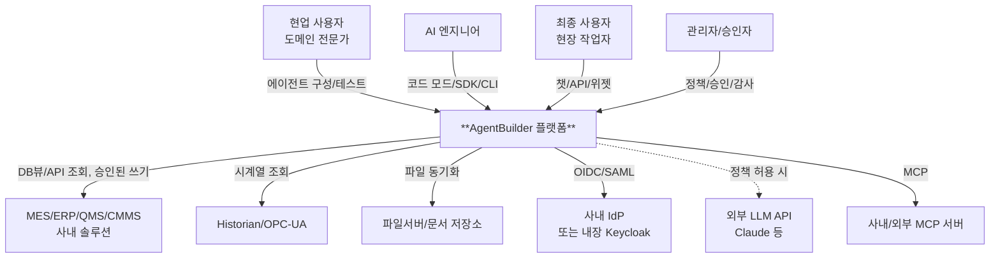
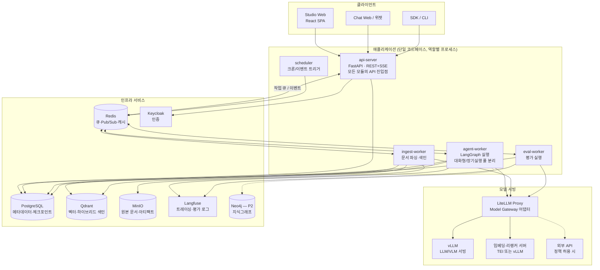
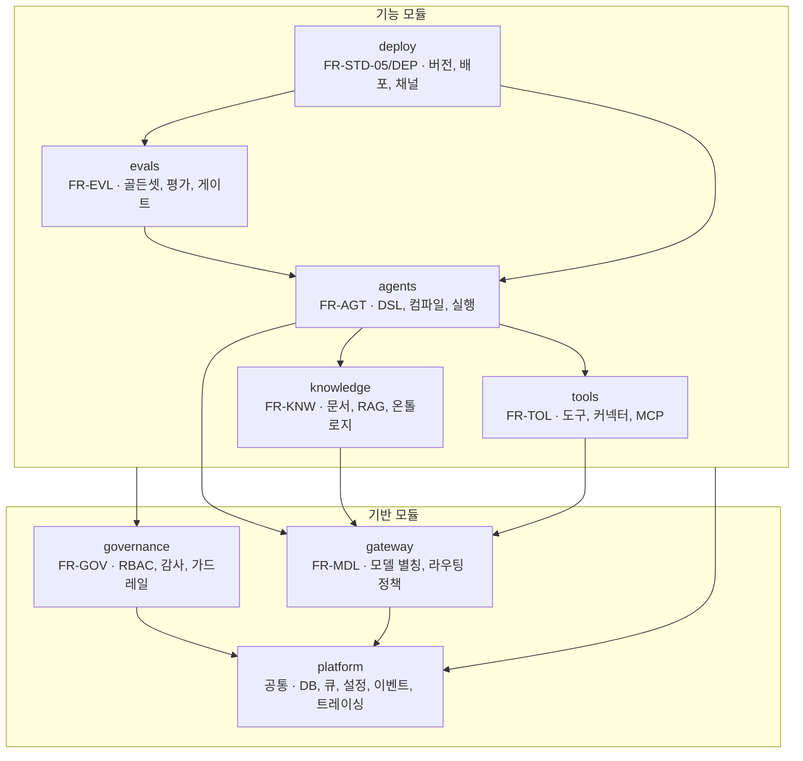
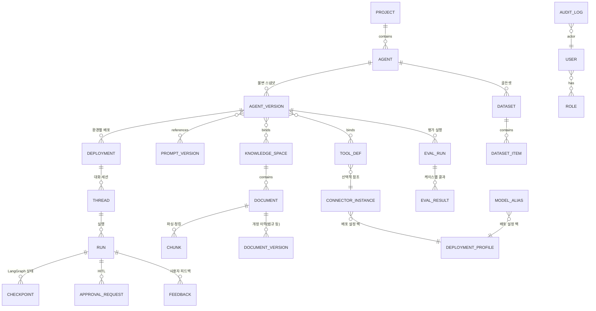
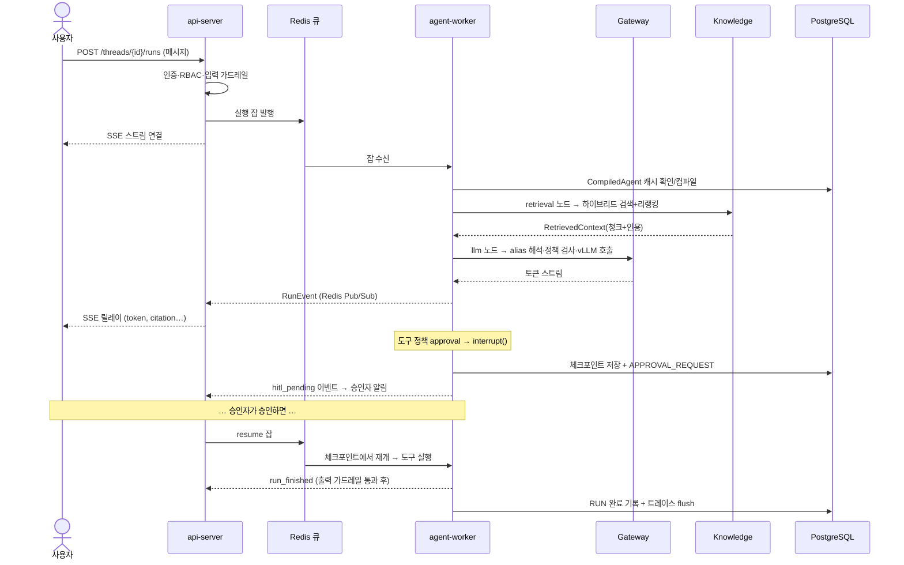
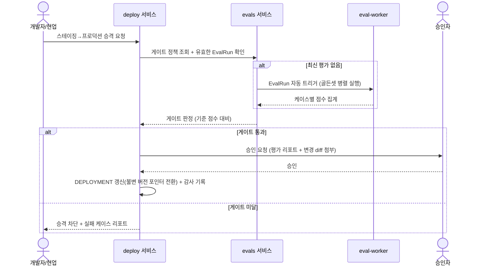

# AgentBuilder 설계문서 (Architecture Design)

**제조 도메인 특화 Enterprise AgentBuilder 플랫폼/Studio**

| 항목 | 내용 |
|---|---|
| 문서 버전 | v0.1 (Draft) |
| 작성일 | 2026-07-17 |
| 기반 문서 | [01-functional-specification.md](01-functional-specification.md) v0.3 (확정) |
| 상태 | 검토 대기 |
| 다음 단계 | 설계 확정 → 개발 (하네스 엔지니어링 최적화 적용) |

> **읽는 법**: 2~3장에서 전체 그림을 잡고, 4~5장에서 핵심 계약(DSL·데이터 모델)을 이해한
> 뒤, 6장에서 담당 모듈의 상세를 본다. 7장의 시퀀스 다이어그램은 모듈 간 상호작용을
> 이해하는 지름길이다. 각 절에는 근거가 되는 기능 요구사항 ID(FR-xxx)를 표기했다.

---

## 목차

1. [설계 목표와 아키텍처 스타일](#1-설계-목표와-아키텍처-스타일)
2. [전체 아키텍처](#2-전체-아키텍처)
3. [모듈 구조와 의존 규칙](#3-모듈-구조와-의존-규칙)
4. [Agent Definition DSL 명세](#4-agent-definition-dsl-명세)
5. [데이터 모델](#5-데이터-모델)
6. [모듈별 상세 설계](#6-모듈별-상세-설계)
7. [핵심 실행 흐름 (시퀀스)](#7-핵심-실행-흐름-시퀀스)
8. [API 설계](#8-api-설계)
9. [배포 아키텍처](#9-배포-아키텍처)
10. [보안 설계](#10-보안-설계)
11. [확장 포인트 (포트/어댑터 카탈로그)](#11-확장-포인트-포트어댑터-카탈로그)
12. [저장소 및 코드 구조](#12-저장소-및-코드-구조)
13. [설계 결정 기록 (ADR)](#13-설계-결정-기록-adr)
14. [개발 단계 이행 계획](#14-개발-단계-이행-계획)

---

## 1. 설계 목표와 아키텍처 스타일

### 1.1 설계 목표

| # | 목표 | 달성 수단 |
|---|---|---|
| G1 | **모듈식·유연성**: 핵심 의존성(엔진/DB/모델) 교체 가능 | 포트/어댑터(헥사고날) 패턴, 모듈 간 계약 기반 통신 |
| G2 | **운영 단순성**: 단일 GPU 서버부터 K8s까지 동일 코드 | 모듈러 모놀리스 + 역할별 워커 분리 |
| G3 | **선언적 단일 소스**: 캔버스/코드가 같은 정의를 편집 | Agent Definition DSL이 유일한 계약 |
| G4 | **Enterprise 신뢰성**: 평가 게이트·감사·HITL 내장 | 횡단 레이어를 코어 실행 경로에 구조적으로 배치 |
| G5 | **이해 용이성**: 새 개발자가 하루 안에 구조 파악 | 모듈 = 기능정의서 FR 영역과 1:1 대응, 표준 폴더 구조 |

### 1.2 아키텍처 스타일: 모듈러 모놀리스 + 포트/어댑터

**결정** (근거는 [ADR-01](#13-설계-결정-기록-adr)):

- 백엔드는 **하나의 Python 코드베이스**(모듈러 모놀리스)로 개발하고, 프로세스는 역할별로
  분리 기동한다 (`api-server`, `agent-worker`, `ingest-worker`, `eval-worker`, `scheduler`).
  마이크로서비스 분리는 하지 않는다 — 온프레미스 단일 서버 프로파일에서 운영 복잡도가
  이득을 압도한다. 단, 모듈 경계를 강제해 향후 분리 여지는 남긴다.
- 각 모듈은 **포트(추상 인터페이스)** 를 통해서만 외부 기술(LangGraph, Qdrant, LiteLLM,
  Docling 등)에 접근한다. 외부 기술은 **어댑터**로 감싼다. 이것이 "교체 가능한 모듈식
  코어"의 구현 방식이다 (기능정의서 설계 원칙 3).

```
        ┌────────────────────── 모듈 (비즈니스 로직) ──────────────────────┐
        │   도메인 모델 + 서비스 + 포트(추상 인터페이스) 정의                │
        └──────────────────────────────┬───────────────────────────────┘
                                       │ 포트 (Protocol/ABC)
        ┌──────────────────────────────┴───────────────────────────────┐
        │  어댑터: LangGraphCompiler / QdrantStore / LiteLLMClient /     │
        │          DoclingParser / Neo4jGraph / KeycloakAuth ...        │
        └───────────────────────────────────────────────────────────────┘
```

### 1.3 모듈 간 통신 규칙

| 상황 | 방식 |
|---|---|
| 동일 프로세스 내 모듈 호출 | 포트 인터페이스 직접 호출 (동기) |
| 프로세스 간 작업 전달 (실행/색인/평가 잡) | **Redis 기반 작업 큐** (arq/Celery — [ADR-04]) |
| 상태 공유 | PostgreSQL 단일 진실 원천. 워커는 stateless |
| 이벤트 통지 (배포 완료, 평가 완료, HITL 대기 등) | PostgreSQL 아웃박스 테이블 + 큐 발행 (신뢰성 우선) |
| 실시간 스트리밍 (토큰/노드 이벤트) | Redis Pub/Sub → API 서버 SSE 릴레이 |

---

## 2. 전체 아키텍처

### 2.1 시스템 컨텍스트 (C4 Level 1)



### 2.2 컨테이너 다이어그램 (C4 Level 2)



### 2.3 프로세스 역할

| 프로세스 | 책임 | 스케일링 |
|---|---|---|
| `api-server` | REST/SSE API, 인증·인가, DSL CRUD·검증, 스트림 릴레이 | 수평 (stateless) |
| `agent-worker` | DSL 컴파일·LangGraph 실행, HITL 인터럽트 처리 | 수평. 대화형 풀 / 장기실행·배치 풀 분리 (FR-DEP-02) |
| `ingest-worker` | 파싱→청킹→임베딩→색인 파이프라인 (FR-KNW-01) | 수평 |
| `eval-worker` | 골든셋 평가 실행, LLM-Judge 호출 (FR-EVL-02) | 수평 |
| `scheduler` | 크론 트리거, 웹훅/Kafka 이벤트 수신 → 실행 잡 발행 | 단일 (리더 선출로 HA — P1) |

---

## 3. 모듈 구조와 의존 규칙

모듈은 기능정의서의 FR 영역과 1:1로 대응한다 (G5: 이해 용이성).



### 의존 규칙 (import-linter로 CI에서 강제)

1. 화살표 방향으로만 import 가능. **역방향·순환 금지**.
2. 모듈 간 접근은 각 모듈의 `service` 공개 API로만. 다른 모듈의 내부(레포지토리, 어댑터)
   직접 import 금지.
3. 외부 라이브러리(langgraph, qdrant_client, litellm, docling …)는 해당 모듈의
   `adapters/` 안에서만 import 가능. 비즈니스 로직에서 직접 사용 금지.
4. `platform`은 어떤 기능 모듈도 알지 못한다 (이벤트는 타입 없는 발행/구독).

### 모듈 내부 표준 구조

```
src/agentbuilder/<module>/
├── domain/          # 도메인 모델 (Pydantic) — 외부 의존 없음
├── ports/           # 추상 인터페이스 (Protocol)
├── adapters/        # 외부 기술 구현체 (LangGraph, Qdrant, ...)
├── service/         # 유스케이스 로직 — 모듈의 공개 API
├── api/             # FastAPI 라우터 (api-server에 마운트)
└── worker/          # 큐 소비 핸들러 (해당 워커에 마운트)
```

---

## 4. Agent Definition DSL 명세

DSL은 플랫폼의 **가장 중요한 계약**이다. Studio 캔버스·코드 모드·SDK·Git 저장 모두 이
스키마를 읽고 쓴다 (FR-AGT-01).

### 4.1 예시 — EHS 파일럿 "안전 절차/MSDS Q&A" 에이전트

```yaml
apiVersion: agentbuilder/v1        # 스키마 버전 (마이그레이션 단위)
kind: Agent                        # Agent | Workflow | Skill
metadata:
  name: ehs-msds-qa
  displayName: "안전 절차/MSDS Q&A"
  domain: [ehs]                    # 도메인 태그
  owner: team-ehs
  description: "화학물질·작업별 안전 절차와 MSDS 질의응답"

spec:
  model:
    alias: chat-large              # 실제 모델 매핑은 Model Gateway가 담당 (FR-MDL-01)
    params: { temperature: 0.1, max_tokens: 2048 }

  systemPrompt:
    ref: prompts/ehs-msds-qa@v3    # 프롬프트 저장소 참조 (FR-STD-04)
    variables: { plant: "{{ context.plant }}" }

  knowledge:                       # Knowledge Space 바인딩 (FR-KNW-02/03)
    - space: ehs-msds
      retrieval: { topK: 8, hybrid: true, rerank: true, filters: [plant] }
    - space: ehs-procedures
      retrieval: { topK: 5, hybrid: true, rerank: true }

  tools:                           # 도구 바인딩 + 실행 정책 (FR-TOL-01, FR-AGT-05)
    - name: chemical-master-lookup   # 화학물질 마스터 조회 (RDB 커넥터)
      policy: auto
    - name: incident-report-create   # 사고 보고 초안 생성
      policy: approval               # HITL 승인 필요

  output:
    citations: required            # 인용 강제 (FR-KNW-03)

  guardrails:
    policyPacks: [org-default, ehs-safety]   # ehs-safety: 인용+면책 강제 (FR-GOV-03, P0)

  execution:
    maxSteps: 12
    timeoutSeconds: 120
    contextBudget: { history: 0.3, knowledge: 0.5 }   # FR-AGT-09

  dataClass: internal              # 데이터 등급 → 라우팅 정책 입력 (FR-MDL-02)
```

`kind: Workflow`는 여기에 `graph:` 섹션(노드/엣지)이 추가된다:

```yaml
spec:
  graph:
    entry: classify
    nodes:
      - id: classify
        type: llm                  # llm | agent | tool | retrieval | branch |
        #                            parallel | hitl-gate | code | subagent
        prompt: { ref: prompts/risk-classify@v1 }
        output: { schema: RiskClass }        # 구조화 출력 (FR-AGT-07)
      - id: assess
        type: subagent             # Agent-as-Tool (FR-AGT-08)
        agent: ehs-regulation-qa@stable
      - id: approve
        type: hitl-gate            # 승인 게이트 (FR-AGT-05)
        approvers: { role: ehs-manager }
        actions: [approve, reject, edit]
      - id: report
        type: tool
        tool: risk-assessment-doc-create
    edges:
      - { from: classify, to: assess, when: "output.riskLevel != 'low'" }
      - { from: classify, to: report, when: "output.riskLevel == 'low'" }
      - { from: assess, to: approve }
      - { from: approve, to: report, when: "action == 'approve'" }
```

### 4.2 스키마 관리 규칙

| 항목 | 설계 |
|---|---|
| 정의 형식 | JSON Schema (Pydantic 모델에서 생성) — Studio·SDK·CI가 동일 스키마로 검증 |
| 버전 | `apiVersion` 단위 마이그레이션. 컨버터가 구버전 → 신버전 자동 변환 (FR-AGT-01) |
| 참조 무결성 | `ref`(프롬프트/도구/Space/에이전트)는 저장 시점 + 컴파일 시점 이중 검증 |
| 버전 고정 참조 | `@v3`(불변), `@stable`(배포 채널 포인터) 두 방식 지원 |
| Git 동기화 | 정의는 정규화된 YAML로 직렬화(키 순서 고정) → diff 가능. Git push/pull API 제공 (P1) |

---

## 5. 데이터 모델

핵심 엔티티와 관계 (PostgreSQL). 상세 컬럼은 개발 단계에서 마이그레이션 코드로 확정한다.



### 저장소 역할 분담

| 저장소 | 데이터 | 비고 |
|---|---|---|
| PostgreSQL | 위 엔티티 전체 + LangGraph 체크포인트 + 감사 로그 + 아웃박스 | 단일 진실 원천. 체크포인트는 `langgraph-checkpoint-postgres` 사용 |
| Qdrant | 청크 벡터(dense+sparse) + 페이로드(메타데이터 필터용) | Space = Qdrant collection 1:1 |
| MinIO | 원본 문서, 파싱 산출물, 배치 실행 입출력 파일, 리포트 | 버킷: `documents/`, `artifacts/`, `batch/` |
| Redis | 작업 큐, 스트림 Pub/Sub, 세션 캐시, 레이트 리밋 카운터 | 유실 허용 데이터만 |
| Langfuse(PG 공유 가능) | 트레이스, 스팬, 스코어 | RUN.trace_id로 연결 |
| Neo4j (P2) | 지식그래프 (온톨로지 인스턴스 + 문서 추출 엔티티) | 온톨로지 스키마 자체는 PostgreSQL |

---

## 6. 모듈별 상세 설계

### 6.1 agents — 코어 엔진 (FR-AGT)

#### 컴파일 파이프라인

```
DSL(YAML) ──▶ ① 파싱/스키마 검증 ──▶ ② 참조 해석(프롬프트/도구/Space를 버전 고정 객체로)
          ──▶ ③ 정적 검증(순환/미도달/권한 정합) ──▶ ④ 그래프 빌드(CompilerPort)
          ──▶ CompiledAgent (실행 가능 객체, 캐시됨)
```

- ①~③은 엔진 중립 — Studio의 실시간 검증도 같은 코드를 사용한다.
- ④만 LangGraph 의존. `CompilerPort` 뒤의 `LangGraphCompiler` 어댑터가 담당한다 (ADR-02).

```python
class CompilerPort(Protocol):
    def compile(self, resolved: ResolvedAgentDef) -> CompiledAgent: ...

class CompiledAgent(Protocol):
    async def astream(self, input: RunInput, ctx: RunContext) -> AsyncIterator[RunEvent]: ...
    async def resume(self, run_id: str, decision: HitlDecision) -> AsyncIterator[RunEvent]: ...
```

#### 노드 타입 → LangGraph 매핑

| DSL 노드 | LangGraph 구현 | 비고 |
|---|---|---|
| `llm` | 프롬프트 조립 → GatewayPort 호출 노드 | 구조화 출력 시 재시도 래퍼 (FR-AGT-07) |
| `agent` (ReAct) | `create_react_agent` 서브그래프 | 도구 정책 미들웨어 포함 |
| `retrieval` | KnowledgeService 검색 노드 | 인용 메타데이터를 상태에 축적 |
| `tool` | ToolService 실행 노드 | 정책(auto/approval/deny) 검사 후 실행 |
| `branch` | 조건 엣지 (CEL 표현식 평가) | LLM 판단 분기는 `llm`+`branch` 조합 |
| `parallel` | fan-out/fan-in (`Send` API) | P1 |
| `hitl-gate` | `interrupt()` + 체크포인트 | 승인 대기 영속화 (FR-AGT-05) |
| `subagent` | 배포된 에이전트 호출 노드 | 깊이 제한, 중첩 트레이스 (FR-AGT-08) |
| `code` | 등록된 커스텀 Python 노드 | 코드 모드 산출물, 서명 검증 후 로드 |

#### 실행 이벤트 모델

모든 실행은 표준 `RunEvent` 스트림을 발행한다 — Studio 실행 시각화, 챗 스트리밍,
트레이싱이 모두 이 스트림을 소비한다 (단일 이벤트 소스).

```
RunEvent = node_started | token | tool_call | tool_result | retrieval_result
         | citation | hitl_pending | node_finished | run_finished | run_failed
```

#### HITL 설계 (FR-AGT-05)

- `hitl-gate` 도달 → LangGraph `interrupt()` → 체크포인트 저장 → `APPROVAL_REQUEST`
  레코드 생성 + 알림 발행 → 워커는 해당 실행에서 해제됨(자원 미점유).
- 승인/반려/수정은 API로 접수 → `resume()`이 체크포인트에서 재개. 승인자는 RBAC 검증.
- 도구 정책 `approval`은 컴파일러가 해당 도구 호출 앞에 암묵적 게이트를 삽입하는 것으로
  구현한다 (별도 메커니즘 없음 — 단일 HITL 경로).

### 6.2 gateway — Model Gateway (FR-MDL)

```
에이전트 요청(alias, dataClass, project)
   │
   ▼
PolicyEngine ── ① dataClass별 허용 백엔드 필터 (기밀→로컬만)
             ── ② 배포 프로파일의 외부 API 모드 확인 (금지/부분/허용)
             ── ③ 프로젝트 예산 확인
   │
   ▼
AliasResolver ── alias → [1순위 백엔드, 폴백 체인]
   │
   ▼
LiteLLM (Python SDK 내장 호출) ──▶ vLLM / Ollama / 외부 API
   │
   └─▶ 사용량 기록(토큰/비용) + 외부 전송 감사 로그
```

- LiteLLM은 **별도 프록시 서버가 아닌 라이브러리로 내장**한다 — 운영 프로세스 수를
  줄이고, 정책 엔진을 호출 경로에 직접 배치하기 위함 (ADR-03).
- 임베딩/리랭커도 동일 별칭 체계 (`embedding-default`, `reranker-default`).
  임베딩 별칭 변경 시 영향 Space 탐지는 Space 메타데이터의 모델 지문(fingerprint) 비교로
  구현 (FR-MDL-03).
- 게이트웨이는 재시도·폴백·타임아웃을 소유한다. 호출 측은 실패 처리를 중복 구현하지 않는다.

### 6.3 knowledge — 지식 레이어 (FR-KNW)

#### 색인 파이프라인 (ingest-worker)

```
업로드/동기화 ─▶ [MinIO 원본 저장] ─▶ 파싱(ParserPort: Docling) ─▶ 클리닝
  ─▶ 청킹(전략 플러그인: fixed | structural | semantic) ─▶ 메타데이터 부착
  ─▶ 임베딩(GatewayPort) ─▶ Qdrant upsert(dense+sparse) ─▶ 상태 갱신(색인 완료)
```

- 각 단계는 `PipelineStep` 인터페이스를 구현하는 플러그인 — Space 설정으로 단계 구성/
  파라미터를 선언한다 (FR-KNW-01). 문서 단위 체크포인트로 부분 실패 재개.
- 증분 업데이트: 문서 content-hash 비교 → 변경 청크만 재색인.
- 법규 문서(FR-KNW-08): `DOCUMENT_VERSION`으로 개정 이력 보관, `effective_date /
  revision_status` 페이로드를 검색 필터·인용 표기에 사용.

#### 검색 파이프라인 (RetrievalService)

```
질의 ─▶ 권한 필터 구성(사용자/에이전트의 Space·문서 등급) ─▶ 동의어 확장(P1: 용어사전)
  ─▶ 하이브리드 검색(Qdrant dense+sparse, RRF 융합) ─▶ 리랭킹(GatewayPort)
  ─▶ (P2) 그래프 확장(GraphRAG) ─▶ 컨텍스트 조립 + 인용 메타데이터 반환
```

- 반환 타입은 항상 `RetrievedContext { chunks[], citations[] }` — 인용은 생성 단계가
  아닌 검색 단계에서 구조적으로 만들어진다 (인용 강제의 구현 기반, FR-KNW-03).
- 검색 디버거(FR-STD-03)는 이 파이프라인의 단계별 중간 결과를 그대로 노출한다.

#### 온톨로지 (P1) / 지식그래프 (P2)

- 온톨로지 스키마(클래스/관계 정의)와 인스턴스(설비/자재/불량코드 마스터)는 PostgreSQL에
  저장 — 편집기·버전 관리·검수 워크플로의 대상. ISA-95 스켈레톤은 시드 데이터로 제공.
- 용어사전은 검색 파이프라인의 동의어 확장 단계와 프롬프트 컨텍스트 주입에서 소비.
- P2에서 `GraphStorePort`(Neo4j 어댑터)를 추가하고, 색인 파이프라인에 엔티티 추출·링킹
  단계를 플러그인으로 끼워 넣는다 — **기존 파이프라인 구조 변경 없이 확장**되도록 지금
  단계 인터페이스를 설계해 둔다.

### 6.4 tools — 도구/커넥터 허브 (FR-TOL)

#### 3계층 분리 모델

```
ToolDefinition (무엇을 하는가)     예: "설비 마스터 조회" — 스키마, LLM용 설명, 실행 정책
      │ 참조
ConnectorInstance (어디에 연결하는가)  예: "본사 MES Oracle 뷰" — 엔드포인트, 자격증명 참조
      │ 소속
DeploymentProfile (어느 배포인가)    고객사별 설정 팩 — 커넥터 인스턴스 목록 소유
```

- 이 분리가 "Agent 개발 시 DB뷰/API 방식 선택"(확정 답변 2)의 구현이다: 같은
  ToolDefinition이라도 배포 프로파일에 등록된 커넥터 인스턴스(RDB형/API형) 중 하나를
  바인딩한다. 자격증명은 시크릿 저장소 참조만 담고 개발자에게 비노출.
- 도구 실행기: JSON Schema 인자 검증 → 정책 검사(auto/approval/deny) → 타입별 실행
  (Python 함수 / REST 호출 / SQL 실행 / MCP call) → 결과 절삭 정책 적용(FR-AGT-09)
  → 감사 기록.
- Text-to-SQL(FR-TOL-04): SELECT 전용 파서 검증 + `EXPLAIN` 비용 상한 + 행 수 제한을
  실행기 레벨에서 강제 (프롬프트 신뢰에 의존하지 않음).
- MCP: `MCPClientAdapter`가 등록된 MCP 서버의 tool 목록을 ToolDefinition으로 자동
  투영. 플랫폼 자신도 지식 검색·온톨로지 조회를 MCP 서버로 노출 (P1).

### 6.5 evals — 평가 파이프라인 (FR-EVL)

- `EvalRun` = (AgentVersion × Dataset × EvaluatorSet). eval-worker가 케이스를 병렬
  실행하고 케이스별 `EvalResult`(점수, 트레이스 링크)를 기록한다.
- Evaluator는 플러그인 (`EvaluatorPort`): `rule.*`(정확일치/포함/정규식/스키마/인용존재),
  `judge.*`(rubric 채점, Ragas 지표), `trajectory.*`(도구 호출 검증, P1), `human`(블라인드
  채점 큐 생성, P1).
- **품질 게이트는 deploy 모듈이 소유**한다: 승격 요청 → 게이트 정책(데이터셋+최소
  점수) 조회 → 최신 EvalRun 검증(없거나 오래되면 자동 트리거) → 통과 시 승격.
  관리자 오버라이드는 사유와 함께 감사 기록 (FR-EVL-03).
- 평가 실행도 일반 실행과 동일한 `RunEvent`/트레이스 경로를 쓴다 — 실패 케이스에서
  트레이스 드릴다운이 공짜로 얻어진다.

### 6.6 governance — 거버넌스 (FR-GOV) & 관측성 (FR-OPS)

#### 인증/인가

- 인증: api-server는 OIDC Resource Server. 배포 프로파일에 따라 Keycloak 단독 또는
  Keycloak이 사내 IdP를 브로커링 (FR-GOV-01) — 애플리케이션 코드는 항상 Keycloak만 본다.
- 인가: `역할 × 리소스 × 행위` 검사를 FastAPI 의존성(`require(resource, action)`)으로
  모든 라우터에 선언. 검색 권한 필터(6.3)와 도구 정책(6.4)도 같은 RBAC 데이터를 사용.

#### 가드레일 배치 (FR-GOV-03)

가드레일은 실행 경로의 3개 고정 지점에 파이프라인으로 삽입된다:

```
사용자 입력 ─▶ [입력 가드레일: 인젝션 탐지·금칙어·주제 필터]
검색/도구 결과 ─▶ [컨텍스트 가드레일: 간접 인젝션 격리 — 외부 유래 텍스트를
                   구조화 블록으로 감싸고 지시성 패턴 탐지]
모델 출력 ─▶ [출력 가드레일: PII 마스킹·인용 검증·도메인 안전 규칙(인용+면책 필수)]
```

- 규칙은 `GuardrailRule` 플러그인(정규식/분류기/LLM 판정)이며 정책 팩으로 묶어 DSL의
  `guardrails.policyPacks`로 바인딩. `org-default` 팩은 강제 적용(해제 불가).

#### 관측성 (FR-OPS)

- `RunEvent` 스트림 → Langfuse 스팬 변환 어댑터(트레이스) + OpenTelemetry 익스포트
  (사내 APM 연동). RUN 테이블에 trace_id 저장으로 상호 탐색.
- 감사 로그: 정책상 기록 대상 행위(변경/배포/승인/외부 전송/도구 실행)를 서비스 레이어
  데코레이터로 기록. append-only 테이블 + 일별 해시 체인(변조 감지).

### 6.7 Studio Web (FR-STD)

- React SPA. 상태 관리: 서버 상태는 TanStack Query, 캔버스 로컬 상태는 Zustand.
- **캔버스 ↔ DSL 동기화 설계**: 편집의 진실 원천은 메모리 내 DSL 문서(JSON) 하나.
  캔버스(React Flow)와 코드 에디터(Monaco)는 둘 다 이 문서의 뷰이며, 각자의 편집을
  패치(JSON Patch)로 문서에 적용 → 상대 뷰가 재렌더. 레이아웃 좌표는 `metadata.ui`에
  저장되어 실행 의미와 분리.
- 실시간 검증: 스키마 검증은 프런트(생성된 JSON Schema)에서 즉시, 참조·정적 검증은
  api-server의 `/validate` 디바운스 호출로.
- 실행 시각화: 플레이그라운드는 SSE로 `RunEvent`를 구독해 노드 상태·토큰·검색 결과를
  실시간 표시 (6.1의 단일 이벤트 소스 활용).
- i18n: ko/en 리소스 번들 (NFR-09).

---

## 7. 핵심 실행 흐름 (시퀀스)

### 7.1 대화형 에이전트 실행 (HITL 포함)



### 7.2 버전 승격 — 품질 게이트 (FR-EVL-03, FR-GOV-04)



### 7.3 문서 색인 (FR-KNW-01)

업로드 → MinIO 저장 → 색인 잡 발행 → ingest-worker가 파이프라인 단계 실행(문서 단위
체크포인트) → Qdrant upsert → 상태 갱신 → (검수 옵션 시) 지식 관리자 승인 후 검색 노출.
실패 시 단계·사유가 색인 대시보드에 노출된다 (FR-KNW-07).

---

## 8. API 설계

REST + SSE. 경로 프리픽스 `/api/v1`. OpenAPI 스펙 자동 생성. 인증: Bearer(OIDC) 또는
API Key(배포된 에이전트 소비용).

| 리소스 | 주요 엔드포인트 | 비고 |
|---|---|---|
| 에이전트 정의 | `GET/POST /agents`, `GET/PUT /agents/{id}`, `POST /agents/{id}/validate` | validate는 컴파일 ①~③단계 실행 |
| 버전/배포 | `POST /agents/{id}/versions`, `POST /versions/{id}/promote`, `POST /deployments/{id}/rollback` | promote가 품질 게이트 경유 |
| 실행 | `POST /threads`, `POST /threads/{id}/runs` (SSE), `GET /runs/{id}`, `POST /runs/{id}/cancel` | 배포된 에이전트는 `/serve/{agent}/...` 별도 표면 |
| HITL | `GET /approvals?status=pending`, `POST /approvals/{id}/decision` | decision: approve/reject/edit |
| 지식 | `POST /spaces`, `POST /spaces/{id}/documents`, `POST /spaces/{id}/search` (디버그용) | 문서 업로드는 presigned URL |
| 온톨로지 | `GET/PUT /ontology/classes`, `/ontology/entities`, `/glossary/terms` | P1 |
| 도구 | `GET/POST /tools`, `POST /tools/{id}/test`, `GET/POST /connectors` | connectors는 관리자 전용 |
| 모델 | `GET /models/aliases`, `PUT /models/aliases/{alias}` (관리자), `GET /models/usage` | |
| 평가 | `GET/POST /datasets`, `POST /eval-runs`, `GET /eval-runs/{id}/report` | |
| 거버넌스 | `GET /audit-logs`, `GET/PUT /policies/guardrails`, `GET/PUT /rbac/...` | |
| 프로파일 | `GET /deployment-profile` (읽기), 프로파일 적용은 설치 도구로만 | 런타임 변경 금지 항목 분리 |

스트리밍 이벤트 포맷: `event: <RunEvent type>` + JSON data — 챗 UI·Studio·SDK가 공유.

---

## 9. 배포 아키텍처

### 9.1 Docker Compose 프로파일 (단일 GPU 서버 — RTX PRO 6000 96GB 기준)

```
[서버 1대]
├── nginx (TLS 종단, 정적 서빙: Studio SPA)
├── api-server ×2
├── agent-worker ×2 (interactive) / ×1 (batch·long-run)
├── ingest-worker ×1, eval-worker ×1, scheduler ×1
├── vllm (주 모델: 32B급 FP8 또는 70B급 4bit, GPU 점유)
├── text-embeddings-inference ×2 (임베딩·리랭커 — CPU 또는 GPU 잔여분)
├── postgresql, redis, qdrant, minio, keycloak, langfuse
```

- GPU 배분 기준: vLLM에 VRAM의 ~85%를 할당하고 임베딩/리랭커는 CPU 모드를 기본으로,
  여유 시 GPU 공유. 용량 산정표는 설치 가이드에 포함 (FR-DEP-01).

### 9.2 Kubernetes (Helm) 프로파일

- 컴포넌트별 Deployment/HPA, GPU 노드풀에 vLLM 배치(taint/toleration), 워커는 큐 길이
  기반 스케일(KEDA). PostgreSQL/Qdrant는 오퍼레이터 또는 외부 관리형 선택.

### 9.3 배포 설정 팩 (Deployment Profile — FR-DEP-01)

```
profile/
├── profile.yaml        # 식별자, 고객사명, 브랜딩
├── auth.yaml           # keycloak-standalone | idp-broker(OIDC/SAML 설정)
├── models.yaml         # 별칭 → 백엔드 매핑, 외부 API 모드(disabled|allowlist|enabled)
├── connectors.yaml     # 커넥터 인스턴스 목록 (자격증명은 시크릿 참조)
├── policies.yaml       # 데이터 등급 정책, 기본 가드레일 팩, 보존 기간
└── secrets.ref         # 시크릿 저장소 참조 (팩 자체에 비밀값 저장 금지)
```

- 팩은 Git으로 버전 관리하고, 설치/업그레이드 도구가 검증 후 적용한다. 애플리케이션은
  기동 시 프로파일을 로드해 정책 엔진·게이트웨이·커넥터 레지스트리를 구성한다.

---

## 10. 보안 설계

| 영역 | 설계 |
|---|---|
| 전송 | 전 구간 TLS (nginx 종단, 내부망 mTLS는 K8s 프로파일 옵션) |
| 저장 | PostgreSQL/MinIO 볼륨 암호화(LUKS 또는 스토리지 레벨), 시크릿은 전용 저장소(초기: SOPS 암호화 파일, K8s: External Secrets) |
| 인증/인가 | 6.6 참조. API Key는 해시 저장, 스코프·만료 필수 |
| LLM 특화 위협 | OWASP LLM Top 10 매핑: 인젝션(직접/간접 가드레일), 과도한 에이전시(도구 정책+HITL), 민감정보 유출(데이터 등급 라우팅+PII 마스킹), 공급망(모델/패키지 오프라인 반입 검증) |
| 커스텀 코드 | 코드 노드/커스텀 도구는 별도 실행 컨텍스트(제한된 import, 자원 상한)에서 로드, 등록 시 관리자 승인 (P1: 프로세스 격리 강화) |
| 감사 | 6.6 참조 — append-only + 해시 체인, SIEM 내보내기(P1) |

---

## 11. 확장 포인트 (포트/어댑터 카탈로그)

새 기술 채택은 아래 포트의 어댑터 추가로 이루어진다 — 코어 수정 없이 확장 (G1).

| 포트 | 기본 어댑터 | 교체/추가 시나리오 |
|---|---|---|
| `CompilerPort` | LangGraphCompiler | 차세대 오케스트레이션 엔진 |
| `LLMPort` (게이트웨이 내부) | LiteLLM | 직접 백엔드 구현 |
| `VectorStorePort` | Qdrant | Milvus, pgvector(소규모) |
| `ParserPort` | Docling | HWP 파서(P1), 특수 도면 파서 |
| `ChunkerStep` 등 파이프라인 단계 | 내장 3종 | 도메인 특화 청킹 |
| `RerankerPort` | BGE-reranker | 한국어 특화 리랭커 |
| `GraphStorePort` (P2) | Neo4j | ArangoDB, RDF 스토어 |
| `EvaluatorPort` | rule/judge/ragas | 도메인 특화 평가기 |
| `GuardrailRule` | 내장 팩 | 고객사 규정 규칙 |
| `ToolExecutor` | python/rest/sql/mcp | 신규 프로토콜 |
| `ChannelAdapter` | web-chat, rest | Teams/Slack/카카오워크(P2) |
| `SecretStorePort` | SOPS 파일 | Vault, K8s Secrets |

---

## 12. 저장소 및 코드 구조

모노레포 (백엔드 + 프런트 + 배포 + 문서):

```
AgentBuilder/
├── docs/                      # 01-기능정의, 02-설계(본 문서), ADR, 운영 가이드
├── src/agentbuilder/          # Python 백엔드 (모듈러 모놀리스)
│   ├── platform/              # 공통: 설정, DB, 큐, 이벤트, 트레이싱, 프로파일 로더
│   ├── agents/                # 6.1 (domain/ports/adapters/service/api/worker)
│   ├── gateway/               # 6.2
│   ├── knowledge/             # 6.3
│   ├── tools/                 # 6.4
│   ├── evals/                 # 6.5
│   ├── governance/            # 6.6
│   ├── deploy/                # 버전/배포/채널/게이트
│   └── entrypoints/           # api_server.py, agent_worker.py, ingest_worker.py, ...
├── studio/                    # React SPA (canvas/, editor/, playground/, admin/)
├── sdk/                       # Python SDK + CLI (정의 push/pull, 로컬 테스트)
├── deploy/
│   ├── compose/               # Docker Compose 프로파일
│   ├── helm/                  # K8s 차트
│   └── profiles/              # 배포 설정 팩 예시(reference profile)
├── templates/                 # 도메인 스타터 (ehs/, quality/, maintenance/, ...)
└── tests/                     # 단위/통합/E2E + 평가 회귀
```

---

## 13. 설계 결정 기록 (ADR)

| ID | 결정 | 근거 | 기각한 대안 |
|---|---|---|---|
| ADR-01 | 모듈러 모놀리스 + 역할별 워커 | 온프레미스 단일 서버 운영 단순성, 모듈 경계는 import-linter로 강제 | 마이크로서비스(운영 부담), 순수 모놀리스(GPU 작업 격리 불가) |
| ADR-02 | DSL → LangGraph 컴파일 (엔진 추상화) | 기능정의 확정 결정. 검증 로직 엔진 중립 유지 | LangGraph API 직접 노출(종속), 자체 엔진(비용) |
| ADR-03 | LiteLLM 라이브러리 내장 (프록시 서버 아님) | 프로세스 수 절감, 정책 엔진을 호출 경로에 직접 배치 | LiteLLM Proxy 별도 기동(운영 대상 증가, 정책 이중화) |
| ADR-04 | Redis 작업 큐 (arq) + PostgreSQL 아웃박스 | 경량 운영. 신뢰성 필요한 이벤트는 아웃박스로 보완 | Kafka(과잉), DB 폴링 큐(지연) |
| ADR-05 | 체크포인트를 PostgreSQL에 (langgraph-checkpoint-postgres) | 백업/운영 일원화, 검증된 공식 어댑터 | Redis(내구성 부족), 파일(스케일아웃 불가) |
| ADR-06 | Space = Qdrant collection 1:1 | 권한 경계·설정 독립성·삭제 용이 | 단일 collection + 필터(등급 분리 취약) |
| ADR-07 | RunEvent 단일 이벤트 소스 | 챗·Studio 시각화·트레이싱이 같은 스트림 소비 — 중복 계측 제거 | 채널별 개별 포맷 |
| ADR-08 | 도구 3계층 분리 (Definition/Connector/Profile) | 고객사별 배포 + 개발 시 연동 방식 선택 요건의 최소 구조 | 도구에 접속 정보 내장(이식성·보안 문제) |
| ADR-09 | 인가 단일화: RBAC 데이터를 API·검색 필터·도구 정책이 공유 | 권한 우회 경로 제거 | 레이어별 독립 ACL(불일치 위험) |
| ADR-10 | 프런트 진실 원천 = DSL 문서 + JSON Patch 양방향 뷰 | 캔버스/코드 모드 충돌 없는 동기화 | 뷰별 모델 유지 후 변환(드리프트 위험) |

---

## 14. 개발 단계 이행 계획

개발은 "하네스 엔지니어링 최적화"를 적용한다 — AI 코딩 에이전트(Claude Code 등)가
효율적으로 작업할 수 있는 저장소 구조와 검증 루프를 먼저 갖춘다.

1. **저장소 하네스 구축** (개발 착수 시 최우선)
   - `CLAUDE.md`: 모듈 맵(3장), 의존 규칙, 포트/어댑터 규약, 실행·테스트 명령 명시
   - 모듈별 스캐폴드 + import-linter 규칙 + CI(lint, type check, 단위 테스트) 선행 구축
   - 빠른 검증 루프: `make verify` 한 커맨드로 lint+type+test, 통합 테스트는 Compose 기반
   - 도메인 스키마(4~5장)를 Pydantic 코드로 먼저 확정 — 이후 모든 작업의 타입 기반
2. **수직 슬라이스 우선 개발 순서** (모듈 나열식이 아니라 동작하는 경로 우선)
   - Slice 1: DSL 정의 → 컴파일 → 단일 에이전트 실행 → SSE 스트림 (지식·도구 없이)
   - Slice 2: + Knowledge Space·색인·하이브리드 검색·인용 (EHS 문서로 검증)
   - Slice 3: + 도구/정책/HITL, Slice 4: + 평가·품질 게이트, Slice 5: Studio 캔버스
   - 각 슬라이스는 EHS 파일럿 시나리오(MSDS Q&A)를 수락 기준으로 삼는다
3. **평가 하네스 셀프 적용**: 플랫폼 자체 개발 중에도 골든셋 기반 회귀(파서 품질, 검색
   품질)를 CI에 포함 — "평가 없이 배포 없다"를 플랫폼 개발에도 적용

---

*본 설계가 확정되면 `docs/03-development-guide.md`에서 개발 환경 구성, 코딩 규약,
CLAUDE.md 하네스 구성, 슬라이스별 상세 작업 분해(WBS)를 정의한다.*
